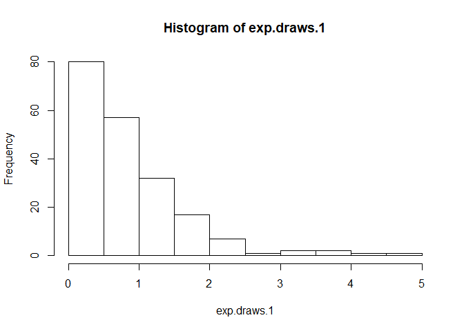

pre-class02
================
Gabriele Borg
September 18, 2018

# pre-class

Make sure you commit this often with meaningfull messages.

### Background

The exponential distribution is defined by its cumulative distribution
function \(F(x) = 1-e^{-\lambda x}\)

The R function ***rexp()*** generates random variables with an
exponential distribution. For example

<center>

<strong>rexp(n=10, rate=5)</strong>

</center>

results in 10 exponentially distributed numbers with a rate
\(\lambda=5\). If you leave out the 5 and just have

<center>

<strong>rexp(n=10) </strong>

</center>

then this results in 10 exponentially distributed numbers with a rate
\(\lambda=1\), this is also referred to as the “standard exponential
distribution”.

### Part 1

1.  Generate 200 random values from the standard exponential
    distribution and store them in a vector `exp.draws.1`. Find the mean
    and standard deviation of `exp.draws.1`.

<!-- end list -->

``` r
library(dplyr)
```

    ## Warning: package 'dplyr' was built under R version 3.5.1

    ## 
    ## Attaching package: 'dplyr'

    ## The following objects are masked from 'package:stats':
    ## 
    ##     filter, lag

    ## The following objects are masked from 'package:base':
    ## 
    ##     intersect, setdiff, setequal, union

``` r
exp.draws.1 <- 
  rexp(n=200)
```

2.  Repeat, but change the rate to 0.2, 5, 7.3 and 10, storing the
    results in vectors called `exp.draws.0.2`, `exp.draws.5`,
    `exp.draws.7.3` and `exp.draws.10`.

<!-- end list -->

``` r
library(dplyr)
rate<- c(0.2, 5, 7.3, 10)
for (i in rate){
  assign(paste0("exp.draws.", i), rexp(n = 200, r = i))
}
```

3.  The function `plot()` is the generic function in R for the visual
    display of data. `hist()` is a function that takes in and bins data
    as a side effect. To use this function, we must first specify what
    we’d like to plot.
    1.  Use the `hist()` function to produce a histogram of your
        standard exponential distribution.
    2.  Use `plot()` with this vector to display the random values from
        your standard distribution in order.
    3.  Now, use `plot()` with two arguments – any two of your other
        stored random value vectors – to create a scatterplot of the two
        vectors against each other.

<!-- end list -->

``` r
hist(exp.draws.1)
```

<!-- -->

4.  We’d now like to compare the properties of each of our vectors.
    Begin by creating a vector of the means of each of our five
    distributions in the order we created them and saving this to a
    variable name of your choice. Using this and other similar vectors,
    create the following scatterplots and explain in words what is going
    on:
    1.  The five means versus the five rates used to generate the
        distribution.
    2.  The standard deviations versus the rates.
    3.  The means versus the standard deviations.

For each plot, explain in words what’s going on.

### Part II (PHP 2560 Only)

5.  R’s capacity for data and computation is large to what was available
    10 years ago.
    1.  To show this, generate 1.1 million numbers from the standard
        exponential distribution and store them in a vector called
        `big.exp.draws.1`. Calculate the mean and standard deviation.
    2.  Plot a histogram of `big.exp.draws.1`. Does it match the
        function \(1-e^{-x}\)? Should it?
    3.  Find the mean of all of the entries in `big.exp.draws.1` which
        are strictly greater than 1. You may need to first create a new
        vector to identify which elements satisfy this.
    4.  Create a matrix, `big.exp.draws.1.mat`, containing the the
        values in `big.exp.draws.1`, with 1100 rows and 1000 columns.
        Use this matrix as the input to the `hist()` function and save
        the result to a variable of your choice. What happens to your
        data?
    5.  Calculate the mean of the 371st column of `big.exp.draws.1.mat`.
    6.  Now, find the means of all 1000 columns of `big.exp.draws.1.mat`
        simultaneously. Plot the histogram of column means. Explain why
        its shape does not match the histogram in problem 5b).
